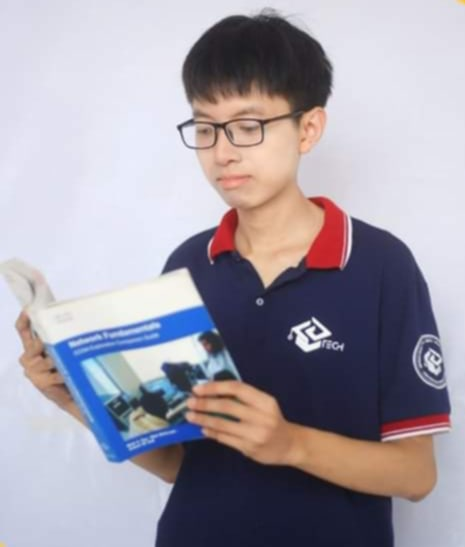

<link rel="stylesheet" type="text/css" href="style.css" /> 

|  |  |
|-------------|-----------------------------------------------|
|  | <h1>Phạm Bình An</h1> 
 phambinhanctb2004@gmail.com  \| (+84) 369 565 170     [GitHub](https://github.com/brianhuster) \| [Website](https://brianhuster.github.io) 
 |

## Education
|  |  |
|-------------|-----------------------------------------------|
| 2022 - 2026 (expected) | **Hanoi University of Science and Technology (HUST)**   *Majors in Educational Technology (EdTech)* |

## Achievements
|  |  |
|-------------|-----------------------------------------------|
| 2022 - 2023 | [**University Scholarship**](https://raw.githubusercontent.com/brianhuster/markdown-cv/main/img/Minh%20ch%E1%BB%A9ng%20h%E1%BB%8Dc%20b%E1%BB%95ng%2020231.jpg)   *For excellent achievements in semesters 20222, 20231*   Hanoi Universiy of Science and Technology (HUST)
| April 2024 | **Consolation prize**   **Student Creative Ideas Challenge 2024** by *School of Information and Communications Technology of HUST*.   Our team worked on a smart glass for visually impaired people.

## Experiences
|  |  |
|-------------|-----------------------------------------------|
| September 2023 | [**Global Project Based Learning**](https://raw.githubusercontent.com/brianhuster/markdown-cv/main/img/Minh%20ch%E1%BB%A9ng%20GPBL.jpg)   Teamworking with Vietnamese and Japanese students on a IOT medicine delivery robot for smart hospitals |
| October 2023 - present | [**EGG CLUB**](https://www.linkedin.com/company/eggclub)   **Member of Specialized Board**   Research and develop educational technology projects for students and teachers |
| March 2024 - present | **R\&D internship**   EJOY LEARNING TECHNOLOGY JOINT STOCK COMPANY   Synthesize and translate scientific articles on technology and education topics for company journals

## Skills
- **Programming languages**: 
    - JavaScript, HTML, CSS, Node.js, markdown : advanced
    - Lua, bash, Latex : intermediate
    - Arduino, Rust, PHP : beginner

- **Frameworks / Libraries**: 
    - Frontend web development : ReactJS, VueJS, Bootstrap
    - Backend development : Express, Flask, WebSocket 
    - Python : flask, Llama.cpp, OpenCV, scikit-learn, pandas, numpy, matplotlib 

- **Database**: 
    - MySQL, MongoDB

- **Other tools**:
    - Version control and containerization : Git, Docker
    - Operating systems : Linux (Ubuntu)
    - Code editors and IDE : Neovim, Vim, Visual Studio Code, Arduino IDE

- **Languages**:
    - 🇻🇳 Vietnamese : native
    - 🇬🇧 English : TOEIC 825 (HUST's eternal exam, October 2022)
    - 🇯🇵 Japanese : JLPT N4 (mock exam)

- **Other soft skills**:
    - Teamwork, presentation, communication, problem solving, critical thinking, time management, self-learning

## Some Personal projects for practice
|  |  |
|-------------|-----------------------------------------------|
| [Gamehub](https://github.com/brianhuster/Gamehub) | A simple game hub website for playing (for players) and managing online games (for admin).   Built with Node.js, ExpressJS, MySQL, EJS (embedded template), CSS, JS   Source code : https://github.com/brianhuster/Gamehub | 
| [Blog-mern](https://github.com/brianhuster/blog-mern) | A blog web application with a RESTful API integration    Built with MERN stack (MongoDB, ExpressJS, ReactJS, Node.js)   Source code : [https://github.com/brianhuster/blog-mern](https://github.com/brianhuster/blog-mern)
| [live-preview.nvim](https://github.com/brianhuster/live-preview.nvim) | A Neovim plugin for live previewing markdown, html, css files.   Built with Lua, Node.js.   Source code : [https://github.com/brianhuster/live-preview.nvim](https://github.com/brianhuster/live-preview.nvim) |

 

Please visit my [Github/brianhuster](https://github.com/brianhuster) for more of my projects

## Extra activities
|  |  |
|-------------|-----------------------------------------------|
| April 2024 | [Tech Club Championship](https://www.facebook.com/story.php/?story_fbid=830979175740586&id=100064855323885&paipv=0&eav=Afb48BpGvoQELL_RPYal9LmfZY6exjcFE7GXLw52gYjoBGWkBrXKgWTKvmAG29JrOuE&_rdr)   Member of the organizing committee |

